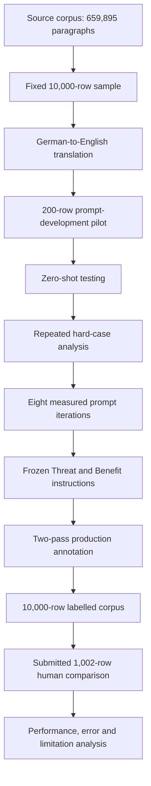

# Economic Framing Annotation

**LLM-Assisted Computational Content Analysis of Economic Threat and Economic Benefit Framing in German Immigration News**

## 1. Project Overview

Our study examines German immigration-news paragraphs published from 2022 to 2026. We investigate the prevalence of Economic Threat and Economic Benefit framing by drawing a 10,000-paragraph production sample from a broader source corpus of 659,895 paragraphs. The project treats Threat and Benefit as separate binary labels, which allows four combined outcomes for any given paragraph: Neither, Threat only, Benefit only, or Both.

To achieve this at scale, our analysis uses Mistral-3-14B through the University of Mannheim maKI infrastructure. We follow an adapted bacchuss annotation-development workflow, which includes iterative prompt development, full production annotation, and a comparison with submitted human labels.

## 2. Key Resources

- [Final Research Report](reports/final_report/Economic_Framing_Annotation_Research_Report.pdf)
- [Methodology](docs/methodology.md)
- [Codebook](docs/codebook.md)
- [Annotation Protocol](docs/annotation_protocol.md)
- [Reproducibility Guide](docs/reproducibility.md)
- [Known Limitations](docs/limitations.md)
- [Aggregate Results](outputs/)
- [Pipeline Scripts](scripts/)

## 3. Research Questions

**Primary question:**
To what extent do German immigration-news paragraphs published between 2022 and 2026 contain Economic Threat and Economic Benefit frames?

**Supporting questions:**
1. How can the SCM economic-frame codebook be translated into explicit LLM instructions?
2. How does model performance change across iterative prompt revisions?
3. How do final frame rates differ descriptively across publications?
4. How well do the production labels agree with submitted human labels, and what types of errors remain?

## 4. Frame Definitions

**Economic Threat:**
Immigration is explicitly connected to economic harm, public cost, welfare strain, labour-market pressure, resource shortages or capacity overload.

**Economic Benefit:**
Immigration is explicitly connected to economic growth, tax revenue, labour supply, skilled-worker shortages, demographic need or prevented economic loss.

*Clarifications on Coding:*
- The labels are coded separately.
- A paragraph may contain both frames simultaneously.
- Quoted or rejected frames count under the study’s occurrence rule.
- Logistical or legal-status reporting alone is not automatically an economic frame.

## 5. Study Design

Our study design was executed across three main stages:

### Prompt-development pilot
- n = 200
- used for instruction development and boundary-case analysis;
- not a fully independent final evaluation set.

### Production annotation
- n = 10,000
- final instructions applied to the production sample.

### Submitted human comparison
- n = 1,002
- model outputs compared against submitted human consensus labels;
- paired submitted coder files were identical;
- this file identity does not establish separate independent coding processes.

## 6. Research Workflow

## 7. Headline Results

**Production Annotation — 10,000 Paragraphs**

| Classification | Count | Percentage |
| :--- | :--- | :--- |
| Neither | 8,989 | 89.9% |
| Threat only | 595 | 6.0% |
| Benefit only | 280 | 2.8% |
| Both | 136 | 1.4% |

- total Threat-positive: 731 — 7.3%;
- total Benefit-positive: 416 — 4.2%.

**Submitted Human Comparison — 1,002 Paragraphs**

| Dimension | Precision | Recall | F1 | Accuracy |
| :--- | :--- | :--- | :--- | :--- |
| Economic Threat | 0.377 | 0.897 | 0.531 | 0.954 |
| Economic Benefit | 0.350 | 0.875 | 0.500 | 0.972 |

**Prompt-Development Pilot — 200 Paragraphs**

| Dimension | Precision | Recall | F1 |
| :--- | :--- | :--- | :--- |
| Economic Threat | 0.833 | 0.789 | 0.811 |
| Economic Benefit | 0.625 | 1.000 | 0.769 |

## 8. Interpretation of Results

The classifier was sensitive but over-inclusive. It identified most human-positive cases, reflected by high recall, but also classified too many human-negative paragraphs as positive, reflected by lower precision.

## 9. Repository Structure

- `config/` — prompts, paths and schemas;
- `docs/` — methodology and research documentation;
- `outputs/` — public-safe aggregate results;
- `references/` — bibliography and citation records;
- `reports/final_report/` — approved final report;
- `scripts/` — the authoritative 00–11 workflow;
- `src/R/` — shared R functions;
- `tests/` — public-safe tests;
- `metadata/` — only academically useful metadata.

## 10. Reproducibility and Quick Start

For full instructions on reproducing the analysis, running the tests, and setting up the environment, please refer to the [Reproducibility Guide](docs/reproducibility.md).

## 11. Data Availability

The row-level source corpus, translations, completed coder files and final annotated dataset are not distributed through this public repository because of copyright, institutional-access and academic data-management restrictions. The repository provides public-safe code, prompts, aggregate results, documentation and the final research report.

## 12. Known Limitations

- English translations may alter nuance from the German source text.
- The instructions were developed for German immigration-news content and may not generalise to other domains.
- Positive frames were rare, making precision sensitive to a relatively small number of false positives.
- A legacy identifier issue caused 19 prompt-development rows to overlap with the submitted 1,002-row evaluation.
- Paired submitted coder files were identical. Calculated agreement statistics describe the submitted files but cannot establish independent coding.
- Criterion descriptions in coder workbooks did not perfectly align with the final configuration definitions.
- Paragraph-level analysis may miss information appearing in neighbouring paragraphs.
- Outlet-level comparisons are descriptive and must not be interpreted as causal or ideological rankings.

## 13. Final Research Report

A full methodological account and discussion of findings is available in the [Final Research Report](reports/final_report/Economic_Framing_Annotation_Research_Report.pdf).

## 14. Citation

Please refer to `CITATION.cff` for the recommended citation metadata.

## 15. License

This repository is licensed under the MIT License. See `LICENSE` for details.
