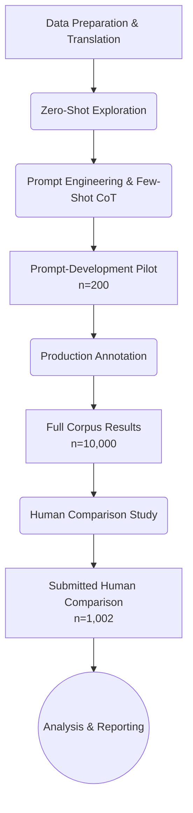

# Economic Framing Annotation: An LLM-Assisted Computational Content Analysis

This repository contains the replication materials and analysis pipeline for evaluating economic threat and benefit framing in media texts. 

The study develops an automated annotation pipeline to classify text according to defined economic framing sub-criteria, subsequently comparing the outputs against human consensus evaluations to measure system reliability and limitations.

## Research Questions

1. How reliably can Large Language Models (LLMs) replicate human annotation of complex, multi-criteria economic frames (threat and benefit)?
2. What are the specific conditions and linguistic nuances where automated classification diverges from human consensus in framing analysis?
3. How do identified framing frequencies vary across publication outlets in the dataset?

## Pipeline Architecture

The following diagram illustrates the study's sequential research methodology:

## Class Definitions

The annotation schema divides economic framing into two primary dimensions. These dimensions are not mutually exclusive; a single paragraph can contain neither, one, or both frames.

### Economic Threat
A paragraph is coded as containing an Economic Threat frame if it explicitly mentions any of the following:
- General threats to economic well-being or prospects.
- Specific threats to the economic prospects of the receiving country/region.
- Labor market harm (e.g., displacement, wage depression).
- Strain on welfare or public finances (e.g., taxpayer burden, benefit depletion).
- Explicit mentions of capacity limits, financial costs, resource shortages, or infrastructure overload (e.g., housing shortages, administrative backlogs).

### Economic Benefit
A paragraph is coded as containing an Economic Benefit frame if it explicitly mentions any of the following:
- Positive economic effects such as tax revenue or economic growth.
- Overall positive economic effects for the receiving country/region.
- Demographic necessity (e.g., aging populations, shrinking workforce).
- Filling labor shortages or providing necessary skills.
- The potential for prosperity contingent on integration measures, or the explicit loss of economic benefits due to restrictive policies (e.g., unrecognised degrees, lack of work permits).

## Verified Results

The analysis generated three distinct tiers of results across the pipeline:

### 1. Prompt-Development Pilot (n = 200)
Initial iterative prompt development was conducted on a 200-row sample to identify boundary conditions and optimize the Few-Shot Chain-of-Thought (CoT) instructions.

### 2. Production Results (n = 10,000)
The finalized prompting strategy was applied to the full 10,000-row translated dataset to establish baseline prevalence rates of threat and benefit frames across the corpus.

### 3. Submitted Human Comparison (n = 1,002)
A submitted 1,002-row human-labelled comparison set was used to compare the LLM outputs with human consensus labels. The submitted paired coder files were identical, so the calculated agreement statistics describe the files but do not independently establish separate coding processes. The LLM's outputs were compared against this human consensus to calculate pairwise reliability, Krippendorff's Alpha, precision, and recall metrics.

## Verified Limitations

This study contains several methodological limitations that constrain the generalizability of the findings:

- **19-Row Pilot/Evaluation Overlap**: There is an inadvertent 19-row overlap between the prompt-development pilot set and the final evaluation set, slightly reducing the strict independence of the test.
- **Identical Paired Submitted Coder Files**: In the submitted records, paired individual coder files were found to be identical, limiting the ability to assess true initial inter-coder divergence prior to consensus.
- **Coder-Workbook Criterion Mismatch**: There are documented discrepancies between the operational criteria provided in the coding workbooks and the final synthesized instructions used for evaluation.
- **Translation Limitations**: The analysis was conducted on English translations of original German texts, potentially introducing translational artifacts or losing language-specific nuances.
- **Low Positive-Frame Prevalence**: The extreme sparsity of the Economic Benefit frame within the dataset restricts the statistical power available to evaluate the model's recall on positive framing.
- **Paragraph-Level Context Limitations**: Classification occurred strictly at the paragraph level, meaning broader narrative context or article-level intent was inaccessible to both human coders and the model.
- **Descriptive-Only Outlet Comparisons**: Analyses comparing framing across different publication outlets remain purely descriptive and do not establish causal relationships.

**Note on Evaluation**: The human consensus dataset serves as a functional comparison point for this study, but should not be considered a perfect gold standard. True independent annotation reliability has not been definitively proven. Furthermore, the model configuration presented here is strictly an exploratory research tool and is not production-ready for automated media monitoring.
