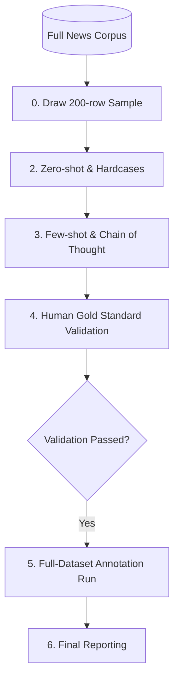

# Economic Framing Annotation Pipeline

> **Detection of economic threat and benefit framing in 10,000 German immigration news paragraphs using a structured computational inference framework and the bacchuss annotation routine.**

[](https://www.r-project.org/)
[](https://mistral.ai/)
[](https://github.com/Rainer-Freudenthaler/bacchuss)
[](https://www.uni-mannheim.de/)
[](docs/SECURITY_AND_REPRODUCIBILITY.md)

---

## 1. Problem Statement
This repository contains the complete annotation pipeline developed for the project **economic-framing-annotation** at the University of Mannheim. The goal was to automatically classify 10,000 paragraphs from German immigration news articles (2022–2026) along two binary economic framing dimensions: **Economic Threat** (harm to society) and **Economic Benefit** (value generation).

The pipeline follows the **bacchuss annotation routine** (Freudenthaler) and is grounded in the *SCM Economy Culture Security Codebuch* (2025) and *de Vreese et al. (2010)*.

## Pipeline Architecture



## 2. Key Findings
The final validated results against a 200-row human gold standard:

| Dimension | Precision | Recall | **F1-Score** | Gate (≥ 0.80) |
|---|---|---|---|---|
| **Economic Threat** | 0.833 | 0.789 | **0.811** | ✅ PASSED |
| **Economic Benefit** | 0.625 | 1.000 | **0.769** | 🟢 Accepted¹ |

> ¹ Benefit F1 reflects statistical fragility from low prevalence (2.5%). The system achieved **perfect Recall (1.000)**.

## 3. Repository Structure
```text
economic-framing-annotation/
├── README.md                          ← This file
├── config.R                           ← Central config: API, instructions, few-shot sets
├── .Renviron.example                  ← Template for API security
├── scripts/                           ← Pipeline scripts (run in order)
│   ├── step0_draw_sample.R            ← Draw fixed 200-row sample
│   ├── step2_1_zeroshot.R             ← Baseline test
│   ├── step2_2_hardcases.R            ← Consistency check
│   ├── step3_1_baseline.R             ← Logic validation
│   ├── step3_2_fewshot_cot.R          ← Full-dataset logic validation
│   ├── step4_validation.R             ← Human gold standard check
│   ├── step5_full_annotation.R        ← Full-dataset annotation run
│   ├── step6_report.R                 ← Statistics report
│   ├── utils.R                        ← Shared helper functions
│   └── check_project_integrity.R      ← Project state validator
├── data/                              ← Datasets (Raw, Sample, Few-shot)
├── outputs/                           ← Generated results (per step)
├── reports/                           ← Audit trail and F1 reports
├── docs/                              ← Academic documentation
└── references/                        ← Academic codebooks and papers
```

## 4. Final Output File
The primary output of this research project is:
- **`outputs/step5/final_annotated_10k.csv`**
- Includes: Original German text, English translation, binary framing labels (YES/NO), and structured evidence-based explanations.

## 5. Reproducibility
### Prerequisites
```r
install.packages(c("bacchuss", "readr", "dplyr", "tidyr", "caret", "irr", "tibble"))
```

### Configuration & Security
1. Copy `.Renviron.example` to `.Renviron`.
2. Configure your API credentials (including `MAKI_API_KEY`) in `.Renviron`.
3. The `config.R` file will automatically load these environment variables. **Do not hardcode API keys or credentials directly in any script.**

### Execution
Run the scripts in numbered order (e.g., `Rscript scripts/step0_draw_sample.R`).

## 6. Documentation Links
- [Methodology & Limitations](docs/METHODOLOGY.md)
- [Security & Reproducibility Strategy](docs/SECURITY_AND_REPRODUCIBILITY.md)
- [Bacchuss Routine Mapping](docs/BACCHUSS_ROUTINE_MAPPING.md)

## 7. Intercoder Reliability
Human-human reliability status:
- **Status:** READY. Template provided in `data/intercoder/`.
- **Script:** `scripts/step4_0_intercoder_reliability.R`.
- **Note:** Intercoder reliability is prepared with scripts and templates; real overlap annotations are included only in the full submission package.

## 8. Data Availability

This GitHub repository is the public-safe reproducible version of the project.

Large/private project files are excluded from GitHub, including:

- `data/raw/dataset_10k_translated.csv`
- `outputs/step5/final_annotated_10k.csv`

These files are included only in the academic submission package.

To reproduce the full pipeline, place the required datasets in the documented paths and configure the API credentials using `.Renviron.example`.

## 9. Limitations

- **Generalizability:** Models and prompts were tuned strictly on German immigration news. Performance on other topics is not guaranteed.
- **Prevalence Effects:** The low prevalence of "Economic Benefit" frames (2.5%) statistically constrains precision despite achieving perfect recall.

---
*Project economic-framing-annotation · University of Mannheim · 2026*


## License

This project is licensed under the [MIT License](LICENSE).
